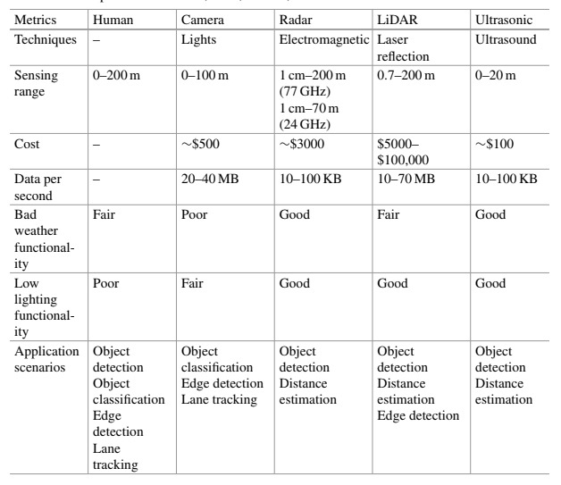
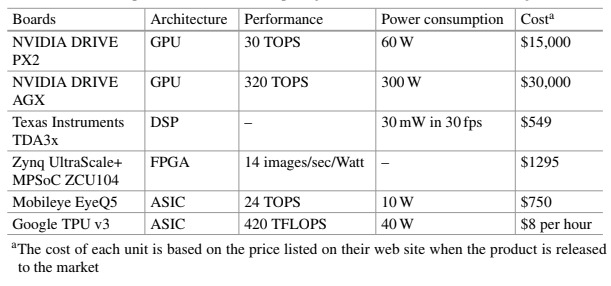

The below collection of the most important building blocks for autonomous mobility nowadays comes from Weisong Shi and Liangkai Liu's book - Computing Systems for Autonomous Driving (2021).

The authors covered topics such as: Sensors, Data Sources, Autonomous Driving Applications, Computation Hardware, Storage, Real-Time Operating Systems, Middleware Systems, Vehicular Communication and Security. We could also add a few additional features such as Human-Machine Interface, Sensor Calibration or Testing, but to keep the material conciese I decided to focus on just those original topics.

## Sensors

#### Cameras

The camera image provides direct 2D information, making it valuable for tasks such as object classification and lane tracking. Most commercially available cameras have a range of up to 100 meters. However, cameras rely on light, so their usability decrease significantly in fog, rain, and snow. Additionally, the data generated by cameras produces another problem, as each camera typically produces an average of 20-40MB of data per second.

#### Radio Detection and Ranging

Radar technique measures the [Time Of Flight](https://en.wikipedia.org/wiki/Time_of_flight) and calculates the distance and speed. Generally, the working frequency of the vehicle radar system is 24GHz or [77GHz](https://en.wikipedia.org/wiki/W_band). The 77GHz version is more popular than 24GHz because of few reasons:

- Higher resolution allowing more precise detection and localization of objects
- Longer detection range (maximum range is around 70 meters for 24GHz and 200 meters for 77GHz)
- Smaller antenna size and reduced interface helping maintain better signal quality

What's worth mentioning radar, compared to camera, is less affected by the weather and low lightning environment, making it very useful in for example distance estimation.

This component produces also much less data than camera, each radar produces 10-100KB per second.

#### LiDAR

Similar to Radar, LiDAR's distance information is also calculated based on the TOF. The difference is that LiDAR uses the laser for scanning, while radar uses electromagentic waves.

LiDAR generates a three-dimensional image of objects, so it has multitude of uses from distance estimation, [SLAM](https://en.wikipedia.org/wiki/Simultaneous_localization_and_mapping), through edge detection to High-Definition Map generation. LiDAR shows good performance from several centimeters to 200 meters, and the accuracy of distance goes to centimeter-level. LiDAR is rarely affected by weather.

However that's very expensive component, for example Velodyne VLS-128E costs over $100,000. Additionaly, LiDAR generates almost 10-70MB data per second, so computional platforms have a lot of work to process such amount of data in real-time.

#### Ultrasonic Sensor

Ultrasonic sensors based on ultrasound to detect the distance. Ultrasound is a particular sound that has a frequancy higher than 20kHZ. The distance is again detecting by measuring TOF. Ultrasonic sensor has limited range, which takes up to 20m. But thanks to good performance in bad weather and low lightning environment and producing just 10-100KB of data it is perfect application to short-range detection like parking assistance.

#### GPS/GNSS/IMU

[GNSS](https://en.wikipedia.org/wiki/Satellite_navigation) is the name for all the satellite navigation systems, including GPS, Galileo and BeiDou. Accuracy of GPS can vary from several centimeters to several meters when different processing algorithms are applied. GPS doesn't work well in places where there is no access to open skies. Besides, the GPS sensing data updates every 100ms, which is not enough for the real-time localization.

Inertial Measurment Unit consists of [gyroscopes](https://en.wikipedia.org/wiki/Gyroscope) and [accelerometers](https://en.wikipedia.org/wiki/Accelerometer). Gyroscopes are used to measure the axes' angular speed to calculate the carrier's position. Accelerometers measures the object's three axes' linear acceleration and can be used to calculate the carrier's speed and position. The drawback is that their accuracy is low.

IMU can be a complementary sensor to the GPS because it has an updated value every 5ms and it works well in environments like tunnels. [Kalman filter](https://en.wikipedia.org/wiki/Kalman_filter) is popular solution to combining these two to get fast and accurate localization results.

## Data Sources

#### Data Charasteristics

As we listed, various sensors can produce hundreds of megabytes of data per second, fed to different autonomous driving algorihtms.

#### Dataset and Benchmark

Autonomous driving dataset is collected by survey fleet vehicles driving on the road, which provides the valuable training data for research in developing autonomous vehicle.

Here are a few popular datasets, each of them includes corresponding benchmarks:

- [KITTI](https://www.cvlibs.net/datasets/kitti/), covers stereo, optical flow, visual odometry, 3D object detection, 3D tracking

- [Cityscapes](https://www.cityscapes-dataset.com/), covers semantic segemtation on pixel-level, instance-level, and panoptic semantic labeling

- [BDD100K](https://bair.berkeley.edu/blog/2018/05/30/bdd/), covers large scale driving video database (over 100,000 videos)

- [DDD17](https://paperswithcode.com/dataset/ddd17), covers end-to-end dynamic and active-pixel vision sensors

#### Labeling

Data labeling is an essential step in a supervised machine learning task, and the quality of the training data determines the quality of the model.

Here a few different types of annotation methods:

- Bounding boxes, most common annotation method in object detection task to define the location of the target object

- Polygonal segmentation, similar to bounding boxes, but uses complex polygonals instead of rectangulars

- Semantic segmentation, pixel-wise annotation, where every pixel in an image is assigned to a class. It's used in cases where environmental context is essential.

- 3D Cuboids, 3D representation of the objects, allowing models to distinguish features like volume and position in 3D space.

Popular image annotation tools are [Makesense.ai](makesense.ai), [Labelimg](https://pypi.org/project/labelImg/), [VGG image annotator](https://www.robots.ox.ac.uk/~vgg/software/via/), [Scalabel](https://doc.scalabel.ai/),

## Autonomous Driving Applications

#### Object Detection

It's widely accepted that the development of object detection algorithms has gone through two typical phases: Conventional ODP and Deep Lerning ODP.

Traditional object detection phase includes Viola Jones Detectors, Histogram of Oritented Gradients feature descriptor and Deformable Part-based Model.

Although today's most advanced approaches have far exceeded the accuracy of traditional methods. As to deep learning-based object detection approaches, the state-of-art methods include the [Regions with CNN features (RCNN)](https://en.wikipedia.org/wiki/Region_Based_Convolutional_Neural_Networks) series, [Single Shot MultiBox Detector (SSD)](https://developers.arcgis.com/python/guide/how-ssd-works/), and [You Only Look Once (YOLO)](https://www.v7labs.com/blog/yolo-object-detection) series.

#### Lane Detection

Similar to Object Detection, we can see Traditional and Advanced methods in Lane Detection. Traditional lane detection approaches aim to detect lane segments based on diverse handcrafted cues, such as color-based features, the structure tensor, the bar filter, and ridge features. This information is usually combined with a Hough transform and particle or Kalman filters to detect lane marking.

However they are prone to effectiveness issues due to road scene variations, e.g., changing from city scene to highway scene and hard to achieve reasonable accuracy under challenging scenarios without a visual clue.

Recently, deep learning-based segmentation approaches have dominated the lane detection field with more accurate performance. VPGNet proposes a multi-task network for lane marking detection. SCNN applies a novel convolution operation that aggregates diverse dimension information via processing sliced features and then adds them together. Lightweight DNNs have been proposed in order to accelerate the detection speed. Besides other methods such as sequential prediction and clustering are also introduced. In a long short-term memory (LSTM) network is presented to face the lane's long line structure issue. Similary, Fast-Draw predicts the lane's direction at the pixel-wise level.

#### Localization and Mapping

Localization is responsible for finding ego-position relative to a map. The mapping constructs multi-layer high-definition maps for path planning. Therefore, the accuracy of these two affects the feasibility and safety of path planning. GPS-IMU based localizatoin methods have been widely utilized in navigation software like Google Maps. However, the accuracy required for urban automated driving cannot be fulfilled by GPS-IMU systems.

Currently, systems that use a pre-build HD map are more practical and accurate. There are three main types of HD maps:

- Landmark-based - consumes less computation than the point cloud-based, but fails in scenarios where landmarks are insufficient.
- Point cloud-based - contains detailed information about the environment with thousands of points from LiDAR or camera. Iterative closest point (ICP) and normal distributions transform (NDT) are two algorithms used in point cloud-based HD map generation.
- Vision-based - recently becoming more popular. The computational overhead limits its application in real systems. Several methods for matching maps with the 2D camera as well as matching 2D image to the 3D image are proposed for mapping.

In contrast, SLAM is proposed to build the map and localize the vehicle simultaneously. Among LiDAR-based SLAM algorithms, LOAM can be finished in real-time. IMLS-SLAM focuses on reducing accumulated drift by utilizing a scan-to-model matching method. Cartographer, a SLAM packege from Google, improves performance by using sub-map and loop closure while supporting both 2D and 3D LiDAR.

There are two types of matching methods: feature-based and direct matching. Feature-based methods extract features and track them to calculate the motion of the camera. Since features are sparse in the image. Directs-based methods, on the other hand, adopts original information for matching that is dense in the image, such as color and depth. Inherent properties of feature-based methods lead to its faster speed but tend to fail in texture-less environments as well. The dense SLAM solves the issues of the sparse SLAM with higher computation complexity.

#### Prediction and Planning

Prediction module evaluates the driving behaviors of the surrounding vehicles and pedestrians for risk assesment. [Hidden Markov Model (HMM)](https://en.wikipedia.org/wiki/Hidden_Markov_model) has been used to predics the target vehicle's future behavior and detect unsafe lane change events.

Planning means finding feasible routes on the map from origin to destination. There are plenty of algorithms for finding the best path to destination. The most widely used nowadays are [197]a\*, [Rapidly-exploring Random Tree (RRT)](https://en.wikipedia.org/wiki/Rapidly-exploring_random_tree) and its variations.

#### Vehicle Control

Vehicle control connects autonomous driving computing systems and the drive-by-wire system. Typically, vehicle control is accomplished by using two controllers: lateral controller and longitudinal controller. Controllers must handle rough and curvy roads, and quickly varying types, such as gravel or mud. The output commands are calculated from the vehicle state and the trajectory by control law. There are various control laws, such as fuzzy control, PID control, Stanley control, and Model Predictive Control.

## Computation Hardware

To support real-time data processing from various sensors, powreful computing hardware is essential to autonomous vehicles safety. Currently, plenty of computing hardware with different designs show up on the automobile and computing market.

## Storage

Single autonomous (not even neccesarily L5) car generate between **20-50TB** of data per day (!). Most of the data comes from sensors mentioned above.

Efficiently stored data can accelerate overall system performance. Creating hierarchical storage and workflow that enables smooth data accessing and computing is still an open question for the future of autonomous mobility in general. Computational storage system called [HydraSpace](https://ieeexplore.ieee.org/document/9319020) is proposed to tackle the storage issue. HydraSpace is designed with multi-layered storage architecture and practical compression algorithms to manage the sensor pipe data.

## Real-Time Operating Systems

Percepting the environment and making decisions effectively in real-time is a big challenge for nowadays AVs. That is why real-time operating systems become a hot topic in the design and implementation of autonomous driving systems.

[QNX](https://en.wikipedia.org/wiki/QNX) and [VxWorks](https://en.wikipedia.org/wiki/VxWorks) are two representative commercialized RTOS widely used in the automotive industry. The QNX kernel contains only CPU scheduling, inter-process communication, interrupt redirection, and timers. Everything else runs as a user process, including a unique process known as "proc", which performs process creation and memory management by operating in conjuction with the microkernel. VxWorks is designed for embedded systems requiring real-time, deterministic performance. VxWorks support multiple architectures and uses real-time kernel for mission-critical applications subject to real-time constraints, which guarantes a response within predifined time constraints.

## Middleware Systems

Middleware is required to facilitate communications between different autonomous driving services. Most existing autonomous driving solutions utilize the [ROS](https://en.wikipedia.org/wiki/Robot_Operating_System), which is communication middleware that facilitates communications between different modules of an autonomous vehicle system. ROS supports four communication methods: topic, service, action, and parameter. [ROS2](https://en.wikipedia.org/wiki/Robot_Operating_System) is promising type of middleware developed to make communications more efficient, reliable, and secure.

Another interesting middleware system is [AutoWare AI](https://www.autoware.org/autoware), based on ROS first "all-in-one" open-source software for autonomous mobility.

In traditional automobile society, the runtime environment layer in [Automotive Open System Architecture](https://www.autosar.org/) (AutoSAR) can be seen as middleware. Many companies develop their middleware to support AutoSAR.

## Vehicular Communication

In addition to obtaininng information from the on-board sensors, the recent proliferatoin in communication mechanisms, e.g., [DSRC](https://en.wikipedia.org/wiki/Dedicated_short-range_communications), [C-V2X](https://en.wikipedia.org/wiki/Cellular_V2X) and 5G, has enabled AVs to obtain informations from other AVs and infrastructure.

#### LTE/4G/5G

LTE is a transitional product in the transition from 3G to 4G, which provides downlink peak rates of 300Mbit/s, uplink peak rates of 75 Mbit/s. 4G comply with 1 Gbit/s for stationary reception and 100Mbit/s for mobile. 5G download speed reached nearly 500 Mbit/s, 17.7 times faster than that of 4G and latency of 5G is less than 30ms, 23ms faster than average 4G metrics.

#### DSRC

DSRC is a type of V2X communication protocol, which is specially designed for connected vehicles, DSRC in based on IEEE 802.11p standard, and its working frequency is 5.9GHz. DSRC provides reliable communication, even when the vehicle is driving 120 miles per hour.

#### C-V2X

C-V2X combines the traditional V2X network with the cellural network, which delivers meture network assistance and commercial services of 4G/5G into autonomous driving. Like DSRC, the working frequency is also 5.9GHz. Generally C-V2X is more suitable for V2X scenarios where cellural networks are widely deployed.

## Security

Security of AVs has risen from the hardware damage of traditional vehicles to comprehensive security with multi-domain knowledge.

#### Sensing Security

As the eye of AVs, the security of sensors is essential. Randomized signals and redundant sensors are usually used to prevent two primary attacks - [jamming](https://en.wikipedia.org/wiki/Radio_jamming) and [spoofing](https://en.wikipedia.org/wiki/Spoofing_attack). The GPS can check signal characteristics and authenticate data sources to prevent attacks. Also, sensing data fusion is an effective mechanism.

#### Communication Security

Communication security includes two aspects: internal and outside communication. The cryptography is frequently used technology to keep the transmitted data confident, integrated and authenticated, however the usage of cryptography is limited by the high computational cost for resource-constrained ECUs. Therefore, another attempt is to use the gateway to prevent unallowed access. In case of outside communication - cryptography is the primary tool. A trusted key distribution and management is built in most approaches, and vehicles use assigned keys to atuhenticate vehicles and data.

#### Data Security

The cryptography is also a significant technology of securing data storage, such as an encrypted database and file system. Besides, access control technology protects stored data from another view, widely used in modern operating systems.

#### Control Security

AVs electrification leads to new attack surfaces with various attack methods, such as jamming attacks, replay attacks, relay attacks, etc. For example, attackers could capture the communication between key and door and replay it to open the door. Parts of these attacks could be classified into sensing security, communication security, or data securtiy, which can be addressed by corresponding protection mechanisms.
