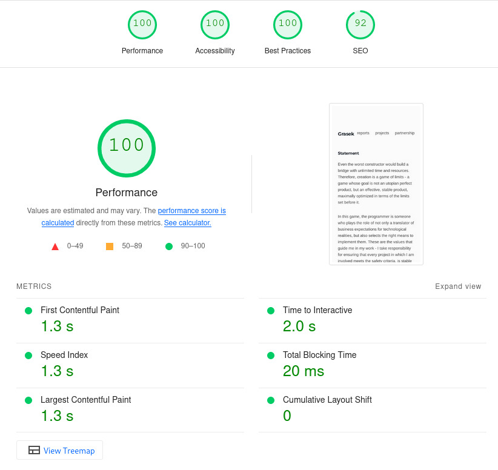

So... Here's the beginning, I'm really curious to see what it's going to be like reading this post in two, five, ten, maybe even more years!

## A few words about the site

The site you're currently reading was written in JavaScript, to be precise I used Gatsby framework. That's not my favorite one, I prefer Svelte, but in this case Gatsby fulfill its duty better than well.

The secret keys, which makes Gatsby probably the fastest currently available framework for building static and semi-static websites (like this blog) are:

- Pre-rendering: Gatsby generates static content and JavaScript files during the build process, which means the site is already rendered when user requests it
- Code Splitting: The code we written is automatically splitted into chunks, that are loaded only when they are needed, reducing the inital load time of the site
- Image Optimization: Gatsby provides built-in image optimization, it means that all images (for example that one above) have slightly worse quality, but they are loaded almost instantly, that's not always good, but I personally prefer worse quality over waiting till image will be loaded

### Hosting provider

At the moment I host the site in Gatsby Cloud, it wasn't my first choice, but after waiting a **few days** for propagation after changing the DNS with the previous provider, I decided to move the site to where it currently is. Gatsby Cloud provides a user-friendly interface and integration with Github account, which is very useful. Moreover, their CDN is exceptionally good (I suspect they use AWS/Cloudflare for this purpose), the whole process from domain transfer through DNS and HTTPS setting to availability took about **2 hours**.

### Design, inspiration

When designing this website, I was inspired by [Eric](https://ekzhang.com), I liked modernist minimalism, so I decided to implement something similar on my website. The purpose was to direct user attention to content, not necessarily to how the site looks like.

### Other resources

Except of previously mentioned I used also:

- svgrepo.com, icons
- getcssscan.com, fancy box shadows
- figma.com, other details, like signature

### Development path

My room's white board is full of things that I would like to implement on this site in the future. First of all - integration, if Github makes it available in its API, stars and labels from each project. What's more, to make the forms from the "partnership" work. I will be working on it after the free trial of Gatsby Cloud, the decision is not final yet.

And most importantly, to produce fruitful content and share amazing projects here.
