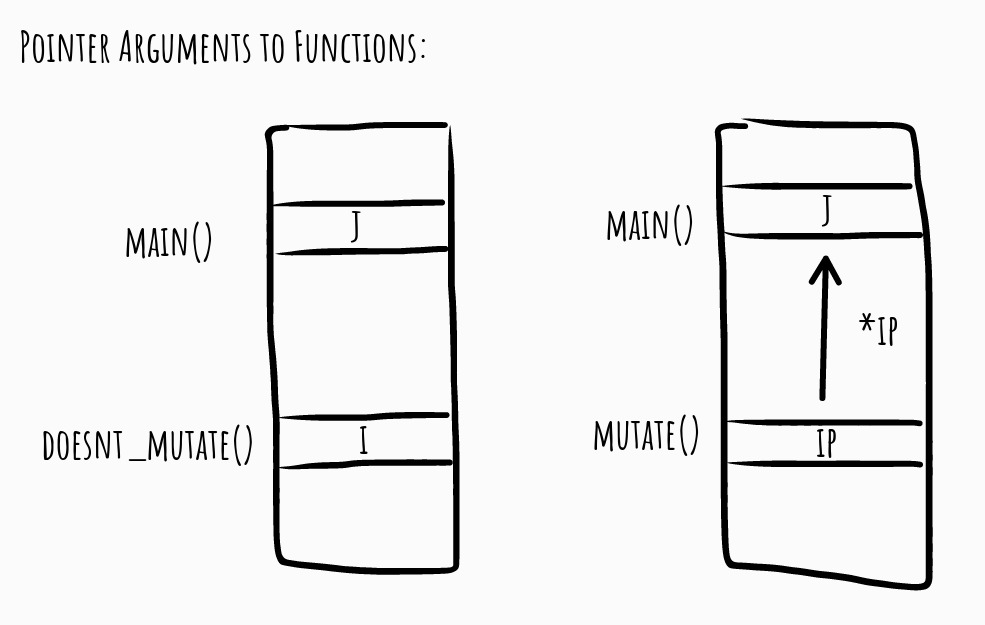

Pointers and memory management are considered among the most
challenging issues to deal with in low-level programming languages such as
C. it's not that pointers are conceptually difficult to understand, nor is it
difficult to comprehend how we can obtain memory from the operating
system and how we return the memory again so it can be reused.

The difficulty arises from the flexibility with which pointers let us manipulate
the entire state of a running program. With pointers, every object anywhere
in a program’s memory is available to us—at least in principle. We can
change any bit to our heart’s desire. No data are safe from our pointers, not
even the program that we run—a running program is nothing but data in the
computer’s memory, and in theory, we can modify our own code as we run
it.

#### Memory, Objects and Addresses

Everything you manipulate when you run a program itself, has to reside _somewhere_ in your computer’s memory—on a disk, in its RAM circuits, in various levels of cache, or in a CPU’s or GPU’s registers. it's not something we necessarily think about when we write
programs, but it's an obvious truth: if objects aren’t found _somewhere_, we
cannot work with them. The reason we can get away with not worrying
about memory is that our programming language handles most of the
bookkeeping.

Consider a simple function for computing the factorial of a number:

```
int factorial(int n) {
    if (n <= 1) return 1;
    else return n * factorial(n - 1);
}
```

When we call the function, we must store the argument, n, _somewhere_.
In the recursive case, we call the function again, and in the second call, we
need another parameter n. We need another one because we need to
remember the current n so we can multiply it to the result of the recursion.
Each recursive call must have its own n stored _somewhere_ in memory.

#### Pointers

You can store the address of an object in another object, and this is where
we get to pointers. A pointer is a variable that stores memory addresses of
other objects.

If we declare:

```
int i = 1; // integer
int *pi = &i; // pointer to integer
int **ppi = &pi; // pointer to pointer to integer
```

Then running:

```
printf("i = %d, &i = %p\n", i, &i);
printf("pi = %p, &pi = %p\n", pi, &pi);
printf("ppi = %p, &ppi = %p\n", ppi, &ppi);
```

We can see the addresses the variables sit it, in my case:

```
i = 1, &i = 0x7fff2097520c
pi = 0x7fff2097520c, &pi = 0x7fff20975200
ppi = 0x7fff20975200, &ppi = 0x7fff209751f8
```

Knowing the address of an object is of little use if we cannot also access
the object and manipulate the object through the pointer. We can do both by
dereferencing pointers . If you put an asterisk in front of a pointer, you get
the object that it points to. For example, this printf() call will print the
value in i because we get what pi points to when we write *pi, and we
print the value in pi (i’s address) when we get *ppi:

```
printf("i = %d, pi = %p\n", *pi, *ppi);
```

.jpg>)

If you want the value in i from ppi, you must dereference twice.
Writing \*ppi gives you the value in pi, which is i’s address, and
dereferencing that gives you i, so \*\*ppi refers to i.

If you assign to a dereferenced pointer, you change the object that it is
pointing at. If you run this code:

```
*pi = 2;
printf("i = %d, pi = %p, ppi = %p\n", i, pi, ppi);
**ppi = 3;
printf("i = %d, pi = %p, ppi = %p\n", i, pi, ppi);
```

you should get output that looks like this (except for the exact
addresses):

```
i = 2, pi = 0x7ffc8cf26dc4, ppi = 0x7ffc8cf26db8
i = 3, pi = 0x7ffc8cf26dc4, ppi = 0x7ffc8cf26db8
```

In both assignments, we change i because that is what both \*pi and
\*\*ppi refer to. We don't change pi or ppi. You don't modify a pointer
when you modify what it points at. If you want to change the pointer, you
must assign to the pointer itself. Here, for example, we point pi to another
integer’s address:

```
int i2 = 42;
pi = &i2;
```

Now, pi holds the address of i2 instead of i. The assignment doesn’t
change i or any of the other variables, but it changes the value of pi such
that it now points elsewhere to the address of i2.

Pointers give us the possibility to refer to the same value through more
than one variable. That is one of the purposes of them. When this happens,
we call it aliasing. First, *pi was an alias for i, and when we assigned
&i2 to *pi, it became an alias for i2.

##### Call by Reference

In C, functions are call by value. What this means is that when you
provide an argument to a function call, that value goes into the local
variable that the corresponding function parameter holds. Consider this
function:

```
void doesnt_mutate(int i) {
    i += 42;
}

```

It takes an integer as its single parameter, the argument will be held in
the local variable i, and the function then adds 42 to it. This modifies the
value stored in i. Now let us imagine that we call the function like this:

```
int j = 0;
doesnt_mutate(j);
```

Simply, j doesn’t change because we call
doesnt_mutate() with it. The variable j holds an integer, it's zero
since we initialize it as such, and it remains zero after the function call.

What we pass to the function is the value that j holds, zero, but not the
variable itself. Inside the function call, i will get the value zero when we
call the function, and then it's updated. But the two integer variables are
stored in different places in memory, and nothing connects them.



It might not be the most realistic code. I probably wouldn’t have written
functions move\*point_horizontally() and
move_point_vertically(), or if I did I would not implement
move_point() based on them but instead go the other way, but the code
illustrates a point (no pun intended). In the code, since we cannot modify
our input beyond the local variable for a point or a rectangle we get as an
argument, we must return a new object every time we want to modify one,
and we need to overwrite the old one. If we assume that both passing an
argument and returning one require copying the object—the compiler might
be able to optimize something away, but it could be two copies—then the
move_point() function results in multiple unnecessary copies.

The move\*point() function potentially copies a point into the
parameter, and it has to return a point, that is, two copies. I say potentially
because the compiler might inline functions and save copying, but in the
worst case, it needs to copy everything. Each of the function calls in the
function body might also copy the object twice. So we could end up with
copying the point six times.

```
point move_point(point p /\* 1 */, double delta*x, double delta_y) {
    p = move_point_horizontally(p, delta_x); /_ 2copies _/

    p = move_point_vertically(p, delta_y); /_ 2copies _/

    return p; /_ another copy _/
}
```

There is nothing wrong with copying structures as input and output, and
for smaller structures, you don't pay much of a performance penalty, but it
is wasteful. Sometimes, it's worthwhile because you get cleaner code. For
large objects, however, you should prefer to **pass a pointer to the object instead of copying it**.

With move\*rectangle() , it gets worse. Here, we might need to
copy two points in and out of the function, and the calls to
move_point() inside the function involve the six copies we counted
earlier, each.

```
rectangle move_rectangle(rectangle rect, /_ 2 _/double delta_x, double delta_y) {
    rect.upper_left = /_ 6 _/
    move_point(rect.upper_left, delta_x, delta_y);

    rect.lower_right = /_ 6 _/
    move_point(rect.lower_right, delta_x, delta_y);

    return rect; /_ 2 \_/
}
```

The larger the object, and the more components it has, the more you
have to copy.

If you want to modify an object, you have to overwrite it every time you
call a function. If we write

```
point p = { .x = 0.0, .y = 0.0 };
p = move_point(p, 10, 10);
print_point(p);
```

it's easy to forget the assignment and end up with

```
point p = { .x = 0.0, .y = 0.0 };
move_point(p, 10, 10);
print_point(p);
```

This is valid C code; the compiler won’t complain, but you don't get
what you want.

If you pass the objects to the functions as pointers, you can modify them
without copying them. You still have to copy data, the input pointer, but **that is always a relatively small object that is quickly copied** (and will be copied in a register in practice which makes it very fast).

A pointer version of move_point_horizontally() will look like
this:

```
void move_point_horizontally(point *p, double amount) {
    p->x += amount;
}
```

The p->x syntax gets the component x from the point structure
through a pointer.

The complete rewrite is listed in the following. The main difference,
except for passing the points and rectangles as references, is that we don't
return an updated object from any of the functions. We don't need to, as
we modify the input object where it is.

```
#include <stdio.h>

typedef struct point {
    double x, y;
} point;

void move_point_horizontally(point *p, double amount) {
    p->x += amount;
}

void move_point_vertically(point *p, double amount) {
    p->y += amount;
}

void move_point(point *p, double delta_x, double delta_y) {
    move_point_horizontally(p, delta_x);
    move_point_vertically(p, delta_y);
}

void print_point(point *p) {
    printf("point <%.2f, %.2f>\n", p->x, p->y);
}

typedef struct rectangle {
    oint upper_left;
    point lower_right;
} rectangle;

void move_rectangle(rectangle *rect, double delta_x, double delta_y) {
    move_point(&rect->upper_left, delta_x, delta_y);
    move_point(&rect->lower_right, delta_x, delta_y);
}

void print_rectangle(rectangle *rect) {
    printf("rectangle:\n");
    print_point(&rect->upper_left);
    print_point(&rect->lower_right);
    printf("\n");
}

int main(void) {
    point p = { .x = 0.0, .y = 0.0 };
    print_point(&p);
    move_point(&p, 10, 10);
    print_point(&p);
    printf("\n");
    rectangle rect = {
        .upper_left = { .x = 0.0, .y = 10.0 },
        .lower_right = { .x = 10.0, .y = 0.0 }
    };

    print_rectangle(&rect);
    move_rectangle(&rect, 10, 10);
    print_rectangle(&rect);

    return 0;
}
```

A separate issue to taking pointers as arguments is returning pointers.
You can return pointers from a function as you can return any other type,
but you have to be careful with what that pointer contains!

it's safe to pass an address of an object on the stack along to further
function calls. The object is alive while those functions execute, and it will
not be deallocated until they, and the calling function, return. But you
should never point to a local variable that is no longer alive. If you never
return the address of a local variable, you will be fine, so be careful when
you return pointers to ensure that they cannot point at local variables.

##### NULL Pointers

NULL pointers are pointers that hold a unique value that sets them apart
from other pointers and indicate that they don't point at anything. This is
different from not actually pointing at anything. A pointer that isn’t
initialized, or points at a variable that no longer exists, does not point at
anything either. We just cannot recognize that such a pointer refers to
memory that it's no longer valid to access. With a NULL pointer, we know
that it doesn’t refer to anything, and we know that we should refrain from
dereferencing it. Most likely, dereferencing a NULL pointer will crash your
program, but it's up to the underlying platform, so you cannot rely on it.
**Nothing good will come of dereferencing a NULL pointer**, though you can
safely assume that.

You set a pointer of any type to a NULL pointer using the literal 0 or the
macro NULL from <stddef.h>.

```
int *i_null = 0; // integer NULL pointer
double *d*null = NULL; // double NULL pointer
```

In the comments here, I specified which type of NULL pointer they
were, because the standard allows for different NULL pointers for different
types. However, if you assign a NULL pointer of one type to another type,
you get that type’s NULL pointer:

```
i_null = (int *)d*null; // Still an integer NULL
pointer
```

and NULL pointers compare equal

```
if (i_null == (int *)d*null) printf("Yep!\n");
if (d_null == (double *)i*null) printf("Also yep!\n");
```

Comparing any NULL pointer to NULL or 0 also evaluates to true.

```
if (i_null == NULL) printf("Yep!\n");
if (d_null == 0) printf("Also yep!\n");
```

NULL pointers, however, don't compare equal to any other pointer.
So

```
int *ip = ...; // any value that is not a NULL pointer
if (i*null == ip) printf("This doesn't happen.\n");
if (ip == 0) printf("Also doesn't happen.\n");
```

So there is not much use in thinking about NULL pointers of different
types as being different. They are simply allowed to be represented
differently, but as the standard does not specify how they must be
represented, merely how they should behave, it makes no practical
difference.

However, the representation can matter if you try to assign zero to a
pointer in some other way.

```
int zero = 0;
int \_ip = (int _)zero;
```

Here, you assign an integer to ip, and you are allowed to do this. You
can use it to point to a specific address. For embedded systems, for
example, this is useful. it's highly platform dependent, and thus not
portable, but it's allowed.

However, you have given ip the address zero, and NULL is not defined to
be zero. The literal 0 , when you assign it to a pointer, means the NULL
pointer. The compiler has to give ip the bit pattern it uses for NULL
pointers, and it has to implement the rules for NULL pointers. Since NULL
pointers typically are the zero address, it will likely work, but this
potentially has a different semantics than assigning the literal 0. You should
not get up to such shenanigan; **use 0 or NULL**.

If you use a pointer as a Boolean:

```
if (p) {
    // Do something...
}
```

then p evaluates to false if p is a NULL pointer, and otherwise it
evaluates to true.

```
if (!p) {
    // we've a NULL pointer
} else {
    // p is not NULL. It points at \_something_
    // but it might point at something invalid
}
```

Again, don’t rely on any particular representation of a pointer. it's when
you use a pointer as a truth value that the NULL pointer rules apply. This
might not be the same as testing if p is NULL:

```
int null = 0;
int \_p = NULL;
if (p == (int *)null) // do stuff
```

Here, you should compare with NULL:

```
if (p == NULL) // do stuff
```

or with the literal 0

```
if (p == 0) // do stuff
```

(this will work because both NULL and 0 are NULL pointers here; they
have that type when we compare with a pointer), or you should use simply
p as a truth value:

```
if (p) // do stuff
```

Those are the ways you should check if a pointer is NULL. Otherwise,
you are entering undefined behavior by relying on the bit representation of
NULL pointers.

Pointers aren't automatically NULL when they don't point at a valid
object. It would require C to keep track of all addresses that you have
assigned any pointer to, which would incur appreciable overhead in your
programs, nor does C automatically initialize pointers to be NULL. C
doesn’t initialize automatic, that is, stack-allocated variables in general, and
the same holds for pointers. You have to explicitly state that a pointer
doesn’t point at anything by assigning it 0 or NULL. it's good practice to
initialize pointers to be NULL if you don't have a better value.

If we start allowing NULL pointers in our code—and generally we
should—then it's a design choice which functions should handle them.
Some we might allow assuming that they never get NULL input, while
others must be able to handle them. If we leave the vector_length()
function as it is:

```
double vector_length(vector *v) {
    double x = v->x, y = v->y, z = v->z;
    return sqrt(x*x + y\*y \* z\*z);
}
```

then it cannot handle NULL. The v-> operation dereferences the
pointer, and **dereferencing NULL pointers is undefined behavior**, typically
crashing your program. it's reasonable to require that this function cannot
handle NULL pointers. It should return the length of a vector, and NULL
means we don't have a vector, so what would a natural return value be in
that case?

There is nothing in print_vector()’s responsibility that says that it
cannot print a NULL vector, so we can update it to do this:

```
void print_vector(vector const \*v) {
    if (!v) {
        printf("NULL\n");
    } else {

    double x = v->x, y = v->y, z = v->z;
    printf("<%.2f, %.2f, %.2f>\n", x, y, z);
}
}

```

##### Const and Pointers

If you declare a variable using the const keyword, it tells the compiler
that you are declaring a constant, a variable that shouldn’t change. It does
two things:

- it will make the compiler complain if you try to change the
  value of a constant
- it gives the compiler the option of optimizing
  references to the value because it knows that you promised not to change
  that value.

If you declare an integer, you can make it constant by putting the _const_ keyword before or after the type:

`const int i = 42;`
or
`int const i = 42;`

You can read the first as “a constant integer i” and the second as “an
integer constant i.” Either formulation works, and both declarations do the
same thing. They make it a compilation error to change the value of i.

If you declare a variable const, then you
cannot assign a new value to it later, and that rule is easy to remember. But
if you add pointers to the mix, things get muddier. A const variable sits
somewhere in memory, at least if the compiler hasn’t optimized that away,
so you can get a reference to that address. If you get a pointer to that
address that you are allowed to write through, you could change the
“constant.” What happens, however, is where it can get complicated.
If you declare a pointer, the type before the \* is the type you point at.
So if you declare

```
const int *ip;
```

The same, of course, is the case if you declare

```
int const *ip;
```

which gives you a pointer to int const which
is the same qualified integer.

This pointer can point to our int const variable i from before
because we've declared that we shouldn’t be allowed to change what it
points at. we've declared that we don’t want to change i, so we shouldn’t
be able to do it indirectly either. If we say that ip points to a constant, then
the compiler will check that we don't change the object we point to, and so
we get the same type safety through \*ip and i when we do

```
int const i = 42;
int const *ip = &i;
```

Both variables say that they will not change the value in i. So here, all
is well. But you could also write

```
int const i = 42;
int _ip = (int _)&i;
```

Now you have a pointer through which you can change i, even though
you have declared i to be const! You are allowed to do this. You are
allowed to cast a qualified type, but are you then allowed to change what
ip points at? The compiler will not complain; you have told it that ip
points to a non-const integer , but what will happen at runtime?

The answer is an unsatisfactory “we don’t know.” The standard says
_that it's undefined behavior_ to change a variable we defined as const. In
practice, however, **compilers usually exploit undefined behavior for optimization purposes**. If you allow it to do what it wants in a given
situation, it might as well try to make the code more efficient.
If you run this:

```
int const i = 42;
int _ip = (int _)&i;
*ip = 13; // i == 42 or i == 13?
printf("i == %d, *ip == %d\n", i, *ip);
```

chances are that i and \*ip have different values after you assign to ip.

Even though we've declared i as const, it doesn’t quite mean that it's a
constant the way compile-time constants are. It has an address when you
use &, so \*ip will point at an address that can contain an integer. This is
safe because int const and int are the same underlying type, and they
only differ in the qualifier const . So you can write to \*ip, and it gets the
value 13, so that is what we will print for that variable in the last line.
However, the compiler might recognize that i is the constant 42 and use
that in the call to printf(). So although we are talking about the same
memory address, we get two different values after the compiler has
optimized the code. Or then again, you might get something completely
different. You have invoked undefined behavior, after all.

To make things more complicated (because why not?), it's not
undefined behavior when you modify a variable that wasn’t declared
const, even if the code goes through a pointer to const at some point
before modifying it.

Imagine that we've a function such as this:

```
void foo(int const *cip) {
    int *ip = (int *)cip;
    *ip = 5;
}
```

We take a pointer to int const, we cast it, and then we modify what
it points to. We are allowed to do this. Then we run code like this elsewhere
in our program:

```
int const i = 42;
int j = 13;
foo(&i);
foo(&j);
printf("i == %d, j == %d\n", i, j);
```

The compiler will likely optimize the generated code, so i remains a 42
after we call foo(&i), but it will not optimize for j, even though foo()
promised not to change what its input points at. What foo() does is valid,
and it should change what its argument points to. You are allowed to change
const values this way.

It would be easier if it was always
illegal to modify a const value. Still, there are many applications where
we want to do so, where the const value isn’t truly const, for example,
because we change some meta-information but conceptually have a const.
When you declare a pointer to const, you ask the compiler to help you
with remembering that you shouldn’t change what it points to, but you are
allowed to—you just need to make your intent explicit through a type-cast.

When you define a variable you allocate the memory for it and you
specify whether it can change. If it's const, you shouldn’t expect it to
change, and the compiler probably won’t expect it either. If you don't
define it as const, then you are allowed to change it, even if you have a
const pointer to it. You can cast the pointer and change the value. If you
call a function that promises not to change its input, the compiler doesn’t
trust it, and neither should you. Because const doesn’t actually mean
constant, it means that you want the type-checker to remind you to be
explicit about your intent before you change the value.

If you declare a pointer to a constant integer, either as

```
const int \*ip;
```

or

```
int const _ip;
```

you have not declared the pointer to be constant. it's the type that the
pointer points at that is constant—not the pointer. Here is the rule for
const (and other qualifiers) and why the second variant is easier to work
with:
**For any type T, T const is a constant of that type.**

Understand “constant” in the context of what we just saw earlier. It
might not be constant, but it's something the compiler will yell at you for
writing to unless you use an explicit cast. If you also use the first variant for
const declaration, you have a special case because a const before the
first type makes that type const. Stick with using the second variant. If
you do, you have the same rule for pointers:
For any type T, T \_ is a pointer to that type.

With these two rules, you can work out that

```
int const \_icp;
```

is a pointer to type T (because it has the form T _) and that the type T
is a constant type; it has the form U const where the type U is int. So
we've a pointer to a constant int. When you apply these two rules, you
will find it easier to read the type declaration from the right and to the left.
The _ and const in the rules affect the type to the left of them, and we
apply the rules recursively—so read it backward.

If we want the pointer to be constant, so it always points to the same
address, but we want to be able to change what it points at, then we can
work out the type declaration from the rules as well. We want a constant, so
write const to the right of the type we are declaring. Now the type has the
form T const. What do we want T to be? It should be a pointer, so we
update T to a pointer U _, and then our type is U _ const. we've
reached the end of our declaration now if we want a constant pointer to
int, because then U must be int, and thus we declare

```
int i;
int _ const cip = &i;
```


We must initialize the pointer here because it's constant, so we cannot
point an address at it later. Here, it points to the variable i, and it always
will. We cannot give it another address. But we can change i and \_cip to
our heart’s content.

The four combinations of const/non-const underlying type and
const/non-const pointers look like this:

```
int _ i*p = 0;
int const * ic*p = 0;
int * const i_pc = 0;
int const \* const ic_pc = 0;
```

You can change both i_p and what it points to because none of those
are const. For ic_p, you can change the pointer, but not what it points at.
With i_pc, you cannot change the pointer, but you can modify what it
points at, and with ic_pc you can modify neither of the two.

We can assign from a const variable to a non-const. You can assign a
const pointer to a non-const pointer . Naturally, you can also assign a
non-const pointer to a non-const pointer, but there is nothing
particularly surprising in that. With pointers, though, we also have to
consider what we point at. We could make a rule that you can only assign
between pointers to the exact same type, but there is nothing wrong with
letting a pointer, which promises not to change its pointed-at value, look at
a non-const address. it's not changing anything, so there is no reason to
restrict it from doing so. And indeed, we are allowed to assign a pointer to
non-const to a pointer to const.

The rules for declaring types and assigning between pointers are the
same as we add more levels of indirection, so I will not go on about it for
much longer, but there is a point I want to make so I will take us one more
level up and add pointers to the four types we've seen so far.


```
typedef int _ T;
typedef int const _ U;
T _ i*p_p = 0;
U * ic*p_p = 0;
T const * i*pc_p = 0;
U const * ic*pc_p = 0;
```

We can assign from i*p_p to i_pc_p because they have type T \*
and T const *, and we can assign from ic*p_p to ic_pc_p because
they have type U * and U const \_, respectively.

You might now object that surely there shouldn’t be a problem with
assigning from, for example, i_p_p to ic_p_p, because you make a non-
const value const, so you won’t change anything you shouldn’t. You
restrict what you can do, and that cannot cause problems. The thing is that it
can—because you can create a non-const alias to a const object if you
were allowed to do this. Say I have variables

```
int *p = 0;
int const ** q = 0;
int const i = 42;
```

In the figure below, boxes and arrows that are
dashed don't represent actual objects. We start with p and q as NULL
pointers, so they don't point at any existing objects. The dashed boxes are
there to show their type. Actual data will be shown in
fully drawn boxes.

I can take the address of p, it has type int \*\*, and assign it to q. This
is the assignment that isn’t allowed, but we do it anyway (and in code, you
can explicitly cast it, so you can always do it, even if you shouldn’t).

```
q = (int const \*\*)&p;
```

Now I have created an alias for p in *q. In the figure, boxes that touch
are aliases; they are the same object but represented as different boxes to
indicate their types. The pointer q points at the object p, so p and *q are
the same objects, and unless we direct q somewhere else, they remain so.
This means that anything they might end up pointing at later will be
accessible through both of them.
Then we assign &i to \*q:

```
*q = &i;
```

Both the address of i and _q have type int const _, so this is a
perfectly valid assignment. We expect to be able to assign one pointer type
to another, so we aren't doing anything wrong when doing that.

However, it creates more aliases. Since q points to p and *q now points
to i, all three of *p, \*\*q, and i refer to the same object. They differ in
type; *p is not const, but the other two are. But because *p is not
const, we can change the value of the object through it. The actual object
is const; we declared that memory location to be int const, so if we
change \*p, we enter undefined behavior.

You can try it out yourself with this program. The questionable part is
the assignment from &p to q, where the code needs an explicit cast to
compile. When I run the program, I get different values for i and \*p in the
last printf(), because the compiler has optimized reading the const
integer. What you get is up to your compiler. The behavior is undefined.

```
#include <stdio.h>

int main(void) {
    int \*p = 0;
    int const \*\*q = 0;
    int const i = 42;

    q = (int const \**)&p;
    *q = &i;

    // Now I have an int alias to an int const!
    printf("&i == %p, *p == %p\n", (void \_)&i, (void\_)p);

    // DANGER: We are trying to change const int
    *p = 5;

    // This may or may not actually change i.
    // it's up to the C compiler
    printf("i == %d / %d\n", i, \*p);

    return 0;
}
```


What about the other types? Do I run into the same problem if I assign
from int ** to int const \* const? No, here I cannot do the same
trick to create an invalid alias, but that is because I consider the types in
isolation. If we allow ourselves to add another level of pointers, we are back
in the same situation. Consider below picture. Here, we've an int **
pointer p, we assign its address to an int const _ const \*\* pointer
u, and when we then assign the address of an int const _ const
object, r, into \*q, we've created not just one but two illegal aliases.


Admittedly, here we aren't assigning an int \*\* to an int const \* const \* when we assign from &p to q. The types are int **_ and
int const _ const **. We don't create a problem if we allowed
assignments from int \*\* to int const _ const _, but then we
would have to disallow assignments for some cases with more levels of
pointers.

In the examples, we've exploited that we can write &p into q and then
an object we shouldn’t modify into \*q, but there can be several levels of
references between the two places where we write pointers to create an
illegal alias. All it takes is that we've a place where we can write p into a
pointer structure that allows us to write another, more restricted type, r,
somewhere further down the chain. By “more restricted” I mean that r has
an immutable object in its chain of pointers that is allowed to be modified
through p.

If there is a non-const link in the type we assign from, to the left of a
non-const link in the type we assign to, then we can create an illegal alias
this way. This is what the type-checker prevents. If the first link in the first
assignment is non-const for p but const for q, we cannot smuggle in the
extra assignment to make an illegal alias. That is why we can add a const to
the type we point at. If the type except for the const at the immediate
level is the same, then we cannot have alias issues either—if the type is the
same, then what we can modify with one alias we can also modify through
another.

The assignment rules are stricter than they need to be. They prevent
entirely safe assignments, like int \*\* to int const _ const, where
you cannot smuggle in any false alias—if you tried to put a const object
into a chain with the int \*\* alias, you would have to go through the int
const _ const type, which doesn’t allow you any assignments. You
could allow such assignments but at the cost of complicating the type rules.
Or make a special case for links of pointers that are all const. C takes the
simpler approach and allows you to add const to the object you point to,
but otherwise the type must be the same.

##### Restricted Pointers

When the compiler sees a const variable (but not a pointer to const), it
knows that its value doesn’t change, so it can optimize the code it generates
to exploit this. If it reads the value of a const variable, it can generate
code that remembers the constant value instead of fetching it from a
variable. Getting a constant is orders of magnitude faster than fetching a
value from cache or main memory, so there is much to gain here. The
restrict keyword provides a similar optimization opportunity. it's a
qualifier to a pointer type (so like with const, you need to put it after the
to modify the pointer and not the underlying type). It tells the compiler
that this pointer is not an alias of anything else; the memory it points at is
only referenced through the pointer itself. Writing to other pointers will not
change the value it points at, and writing through the pointer will not affect
what other pointers read.

Before the compiler generates code, it will analyze it to find the optimal
machine code. If it can work out where you get data from, and maybe
remember it for later instead of fetching it from memory every time you use
it, it can generate faster code. The promise you make when you write
restrict helps it eliminate the case where it would otherwise have to
assume that a value you access could have chanced since it fetched data
from it last and force it to fetch the data once more. Beware, though, that
current compilers aren't really good at warning you if you break that
promise! If you actually modify data through a different pointer, the
optimized code will be incorrect.

The following program illustrates the difference:

```
  #include <stdio.h>

  void abc(int *a, int *b, int *c){
    *a += *c;
    *b += *c;
  }

  void abc_restrict(int *a, int _b, int _ restrict c) {
    *a += *c;
    *b += *c;
  }

  int main(void) {
    int x, y;
    x = y = 13;

    // No problem here. we haven't made any restrict promises
    abc(&x, &y, &x);
    printf("%d %d\n", x, y);

    // We break the promise here by passing
    // using &a both as argument a and c in the function
    x = y = 13;
    abc_restrict(&x, &y, &x);
    printf("%d %d\n", x, y);

    return 0;
  }
```

In the function abc(), we add the value that c points at to the integers
that a and b point to, and we dereference c twice to do this. We call abc()
as abc(&x,&y,&x), so c points to the same integer as x. Consequently,
when we update *a, we change the value at *c before we add it to \*b.

With abc_restrict(), we've told the compiler that *c doesn’t
change (unless we write to *c, which we don’t). It is, therefore, free to
remember *c from the first access, so when it needs *c to add it to \*b, it
can use the saved value.

In this code, I lied to the compiler when I told it
that \*c wouldn’t change through other pointers, because both a and c point
at the same integer, x, but the compiler is gullible and believed me, and it
might have optimized the code accordingly.

When I run the code without compiler optimization, the result of both
function calls is the same:

```
26 39
26 39
```

If I turn on optimization, however, I get

```
26 39
26 26
```

In the second function, the compiler didn’t fetch the value at \*c a
second time to add it to \*b. I have told it that it doesn’t change, and it
believed me.

The optimization that the compiler can do with restrict is similar to
what it can do with const, but you are allowed to change what c points at.
The compiler will change the value there, and it will recognize that the
value has changed if you dereference the pointer again. The optimization is
only there to tell the compiler that the value doesn’t change through some
other pointer. Then the code that the compiler generates can remember
values instead of fetching them again each time you look at the memory at
the other end of a restricted pointer.

#### Pointers and Types

If pointers simply hold memory addresses, why do they have different
types? Isn’t a memory address just a memory address? Usually, yes, an
address is simply an address on a modern architecture, but the language
standard doesn’t guarantee it. Pointers to different types are allowed to have
different representations if the underlying hardware requires it (with a few
rules for how you can convert between them), and you should be careful
with assuming that they hold the same kinds of addresses.

Even if a pointer merely holds an address, and all addresses are equal,
there are still at least two reasons that we want them to have types.

- First is type-checking. In statically typed languages such as C, the type-checker
  seeks to eliminate programming errors by analyzing your program and
  checking if all variables are used in a way consistent with their intended
  purpose, as specified by their type. Many operations are nonsensical on
  most types. What does it mean to turn a floating-point number into
  uppercase? Or divide a string by four? If you attempted to do it in a running
  program, it would either crash or completely garble up its computation. The
  type-checker is there to prevent such errors. it's not perfect at catching all
  errors, which is provably impossible for a program to do, but it identifies
  many errors that want to catch as early as possible—before your program is
  running in any critical setting.

- Second, types do more than check that you use objects as you intended.
  They specify how bit patterns and chunks of computer memory should be
  interpreted. A 64-bit integer and a 64-bit floating-point number are both 64-
  bit binary words, but we interpret the bit patterns differently. We also
  interpret a 64-bit and a 32-bit integer differently, when we look at the memory location where we find it. If we are looking for a 64-bit (or 8-byte)
  integer, we need to look at 8 bytes to get the number; if we are looking at a
  32-bit (4-byte) integer, we only need to look at the next 4 bytes at the
  address. When you dereference a pointer, you want C to interpret what it
  finds at the address the correct way. The pointer type ensures this. If we
  only worked with (untyped) addresses, we would need to explicitly specify
  the interpretation we want of what we point at, each time we dereference.

##### Pointers, Types, and Data Interpretation

The standard uses the term “undefined behavior” frequently means that you are allowed to do it, but you won’t know what will happen
in general. it's not laziness that leaves things undefined; instead, **it's giving compilers freedom to optimize their code to the hardware the code will run on**.

Suppose you specify the behavior of a program too tightly. In that case,
the compiler has to generate extra code to adjust the behavior when it
deviates from what the underlying hardware would do. Leaving it undefined
frees the compiler to generate optimal code for any platform. The side
effect is, of course, that you cannot write portable code if you rely on the
behavior that the standard leaves undefined. The following example is not
portable to all platforms, because I cast between pointer types that I might
not be allowed to. It will probably work for you as well, as most desktop
architectures will allow it, but if it doesn’t work, read the example and
move on to the next section where I explain why that might be.

But back to the example. If pointers are just addresses, we can cast one
pointer type to another and make them point to the same address. If we then
dereference them, they will look at the same data—it's the data at the same
address, after all—but they will interpret the data differently. Consider this
program:

```

#include <stdio.h>

int main(void){
printf("sizes: double = %zu, long = %zu, int = %zu, char = %zu\n",
sizeof(double), sizeof(long),
sizeof(int), sizeof(char));

    double d;
    double *dp = &d;
    long *lp = (long *)&d;
    int *ip = (int *)&d;
    char *cp = (char *)&d;
    printf("dp == %p, lp = %p\nip == %p, cp == %p\n\n", dp, lp, ip, cp);

    d = 42.0;
    printf("*dp == %.20f, *lp == %ld,\n*ip == %d, *cp == %d\n", *dp, *lp, *ip, *cp);

    *ip = 4200;
    printf("*dp == %.20f, *lp == %ld,\n*ip == %d, *cp == %d\n", *dp, *lp, *ip, *cp);

    *cp = 42;
    printf("*dp == %.20f, *lp == %ld,\n*ip == %d, *cp == %d\n", *dp, *lp, *ip, *cp);

    return 0;

}

```

Output might be like that:

```

sizes: double = 8, long = 8, int = 4, char = 1
dp == 0x7ffd2c8d8e38, lp = 0x7ffd2c8d8e38
ip == 0x7ffd2c8d8e38, cp == 0x7ffd2c8d8e38

*dp == 42.00000000000000000000, *lp == 4631107791820423168, *ip == 0, *cp == 0
*dp == 42.00000000002984279490, *lp == 4631107791820427368, *ip == 4200, *cp == 104
*dp == 42.00000000002940225841, *lp == 4631107791820427306, *ip == 4138, *cp == 42

```

it's unlikely that you get the same addresses; you might not get the
exact same sizes, but if you are using an x86-64 then the dereferenced values will be the same.

The four pointers all see the same address (illustration below), and dp and lp
know they should look at 8 bytes (their sizeof is 8 sizeof(char) and
char on this architecture is a byte). The pointer ip should look at 4 and
cp at 1 byte. Thus, it should not surprise that we get different values for ip
and cp than we do for the others. That lp and dp interpret what they point
at differently is a consequence of how we represent floating-point numbers.

When we assign 42.0 to the double, we set the bit pattern in its 8 bytes
such that we've the floating-point representation of 42. This looks very
different if we interpret the same bits as a long integer, as we can see. The
integer and character pointers see 0, which we can conclude means that the
low 4 bytes in the double are all 0 bits.

When we assign to *ip, we change the 4 lower bytes. We go through
an integer pointer, so C knows (even though I lied to it) that it's looking
at a memory object of 4 bytes, and it overwrites the existing data with the
bits that represent the integer 4200. It changes both the double and the
long—it changes half their bits, after all—but it's the lower bits, and we
don't see a large change. The change is there, though. We also change the
char at the first byte because the lower byte in the 4-byte 4200 is no
longer 0. We can get the lower byte of a number by taking the division
remainder of 256 (think of bytes as base 256, i.e., 2 to the power of 8), and
that is the 104 we see. When we assign 42 to *cp, we change the char to
42, and we replace the 104 in the integer with 42.


The type we give a pointer tells C how it should handle dereferenced
values, that is, how it should treat the memory at the address we point at
and how many memory cells starting at that address are part of the object.
Since C will look beyond the first address whenever sizeof is greater
than one, you also have to be careful here. If you cast the address of a small
object to a pointer of a larger type, you can quickly get into trouble. You
can always cast integer values to a larger type, for example:

```

int i = 42;
long l = (long)i;

```

This is safe because C already has memory set aside for the variables, and you are merely copying bits.

This, however, is not safe:

```

int i = 42;
long _lp = (long _)&i;

```

If you dereference lp, C will pick 8 bytes from the memory address
where i sits, but there are only four allocated for the integer (on my machine, at least). What happens is anyone’s guess, but it probably will be
bad.

If you want to put a char, an int, and a double at the same position,
then you should use a union. That is what unions are for, after all. You can
achieve the same thing with a union, and that is the safe way to do it. You
can even get pointers of the different types to the union’s address.
The point of the example is not that you cannot put different objects in
the same memory, you can, but you need type information to treat the size
and the data in the memory correctly. If pointers didn’t have types, we
would need to provide the type in some other way.

The third reason we want to give pointers types might be less apparent
but has to do with how we handle arrays of objects (previous two mentioned a few paragraphs earlier) and
array-like objects, that is, memory where we've laid out objects of the
same type contiguously. The next object’s address is exactly one past
previous object’s last address. Here, the types tell us how far apart two
consecutive objects are—objects of type T are sizeof(T) apart—and
because the pointers know how large the objects they point at are, we can
use so-called pointer arithmetic when we work with arrays...

In the following program, I have defined a to be a sequence of five
integers, one to five. This gives me 5 \* sizeof(int) consecutive
memory addresses.

The first integer sits at index 0, the second at offset
sizeof(int), and number i sits at offset (i - 1) _
sizeof(int). The address just past the array is 5 _ sizeof(int).

```

#include <stdio.h>

int main(void) {
int a[] = { 1, 2, 3, 4, 5 };
int n = sizeof a / sizeof \*a;

    // get a pointer to the beginning of a
    int *ip = a;
    char *cp = (char *)a;
    for (int i = 0; i < n; i++) {
        printf("a[%d] sits at %p / %p / %p\n",
        i, (void *)&a[i], (void *)(ip + i), (void *)(cp + i * sizeof *a));
    }

    return 0;

}

```

The line
`int n = sizeof a / sizeof *a;`
is an idiom for getting the correct number of elements in an array. The first sizeof gives us the size of the array, and the second provides us with the size of one element, what the array "points to", so dividing the first by the second gives us the number of elements. Here, of course, we know that
it's five, but we might change the size later and forget to update n. We
don’t use sizeof(int) for the second number for a similar reason. We
don’t want to count the wrong number of elements if we change the type of
the array later.

When running the program, I got:

```

a[0] sits at 0x7fff73451780 / 0x7fff73451780 / 0x7fff73451780
a[1] sits at 0x7fff73451784 / 0x7fff73451784 / 0x7fff73451784
a[2] sits at 0x7fff73451788 / 0x7fff73451788 / 0x7fff73451788
a[3] sits at 0x7fff7345178c / 0x7fff7345178c / 0x7fff7345178c
a[4] sits at 0x7fff73451790 / 0x7fff73451790 / 0x7fff73451790

```

As you can see, the addresses match.

Notice that to get to index i from the integer pointer, we use ip + i.
Because of the type, we know that we need to move in jumps of
sizeof(int) . With the char pointer, we've to explicitly include the
size; a character pointer jumps in quantities of the size of char which is
always 1. This might look like a fringe case where types are important, but
pointer arithmetic is used throughout C programs.

Generally, you don't want to index into the middle of an object,
because you don't know how C chooses to represent objects. But it can
have its uses. For example, we might want to pick out the individual bytes
of an integer.

Here is a program that runs through the array from before and prints the
individual bytes in the elements:

```

#include <stdio.h>
int main(void) {
int a[] = { 1, 2, 3, 4, 5 };
int n = sizeof a / sizeof \*a;

    for (int i = 0; i < n; i++) {
        printf("%d = [", a[i]);
        char *cp = (char *)(a + i);
            for (int j = 0; j < sizeof *a; j++) {
                printf(" %d ", cp[j]);
            }
        printf("]\n");
    }

    return 0;

}

```

We iterate through the integers, and for each integer, we set a char
pointer to point to the address of the first byte in that integer. When we
write a + i, we use a as a pointer, and we get the address of a[i] (with
no ampersand needed because we already get the address from a + i ).
Now we go through the number of bytes in an integer. If cp is a char
pointer, then cp + j is the char that is j addresses higher than it. We can
dereference it with \*(cp + j), but cp[j] is syntactic sugar for doing
exactly this. The types matter for the correct indexing. For the array, a +
i is i integers past a, but cp + j is j characters past cp. The type of the
pointer/array determines what the step size is when we add a number to
them.

You in the next section that you should be careful
with casting from one pointer type to another, this program is actually
standard compliant. You can always cast to a character pointer and use it to
run through the bytes in an allocated object.
When I run the program, I get the output:

```

1 = [ 1 0 0 0 ]
2 = [ 2 0 0 0 ]
3 = [ 3 0 0 0 ]
4 = [ 4 0 0 0 ]
5 = [ 5 0 0 0 ]

```

There are 4 bytes per int (because sizeof(int) is 4 with the
compiler I use), and the numbers 0 to 5 sit in the first byte of the integers,
with the remaining 3 bytes set to 0. This will not always be the case. C does
not guarantee how integers are represented; that is defined by your
hardware architecture. In principle, any kind of bit pattern can be used, but
in practice, there are two integer representations: big-endian and little-
endian . They differ in which direction the most to least significant bytes
sit. Consider a 32-bit integer (pic below). Do we put the first (least
significant) 8 bits into the first byte in memory and then the rest in the
following bytes? Or do we put the eight most significant bits in the first
byte? Different architectures (and various file formats and network
protocols) make different choices, but if you use an x86-64 chip, like me,
then you will have a little-endian architecture, and you will get the same
results as I got earlier.


You can try this program to check if your integers are one or the other. It
computes an integer from its bytes by considering them as base 256
numbers (base 256 because that is the number of digits we've with 8
bits). The only difference between the two functions is the order in
which we go through the bytes.

```

#include <stdio.h>

int little*endianess(int i) {
char \_cp = (char *)&i;
int result = 0, coef = 1;

    for (int j = 0; j < sizeof i; j++) {
        result += coef * cp[j];
        coef *= 256;
    }

    return result;

}

int big*endianess(int i) {
char \_cp = (char *)&i;
int result = 0, coef = 1;

    for (int j = sizeof i - 1; j >= 0; j--) {
        result += coef * cp[j];
        coef *= 256;
    }

    return result;

}

int main(void) {
    for (int i = 0; i < 10; i++) {
        printf("%d: little = %d, big = %d\n", i, little_endianess(i),
        big_endianess(i));
    }

    return 0;
}

```

What's interesting, the program only works for
non-negative integers, but the failure has nothing to do with endianness.
The two-complement representation of negative numbers, used on
practically all hardware, doesn’t allow us to consider a 32-bit integer as a
four-digit base 256 integer. Looking into the guts of an object only takes us
so far, and while we can examine the individual bytes in an integer using a
char pointer, there are limits to what we can do with it.

The way our programs interpret data, stored in its raw bit format,
depends on the type we give our objects, and the same goes for pointers. At
their heart, they aren'thing but addresses into the computer’s memory, but
the type we give them tells the program how to interpret what it finds at the
address they store (and what we mean when we want an address a specific
offset from the address we point to).

#### Summary and Further Reading

The basic idea behind pointers, seeing them as addresses into memory, where the
objects you want to manipulate reside, is a simple one and an elegant
solution to many programming issues. You can use pointers to dynamically
allocate memory as needed when you only know your needs at runtime. You can use pointers to code as well, to parameterize your functions
with behavior that a function user can provide. You can use indirect
references to functions to implement polymorphic data structures, where
behavior at runtime is determined by pointers to functions.

Pointers are powerful, when you
use pointers, you are responsible for your own :) and your program’s safety.

For further reading (resigned from links, there are too many resources available):

- Pointers in particular data structures, like Linked Links and Search Trees
- Allocation Pools
- Reference Counting Garbage Collection
