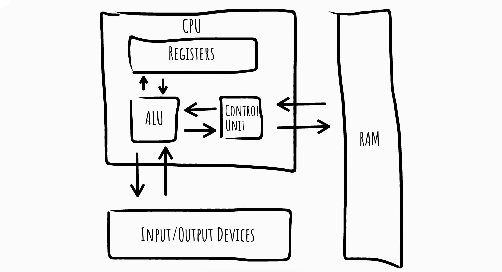
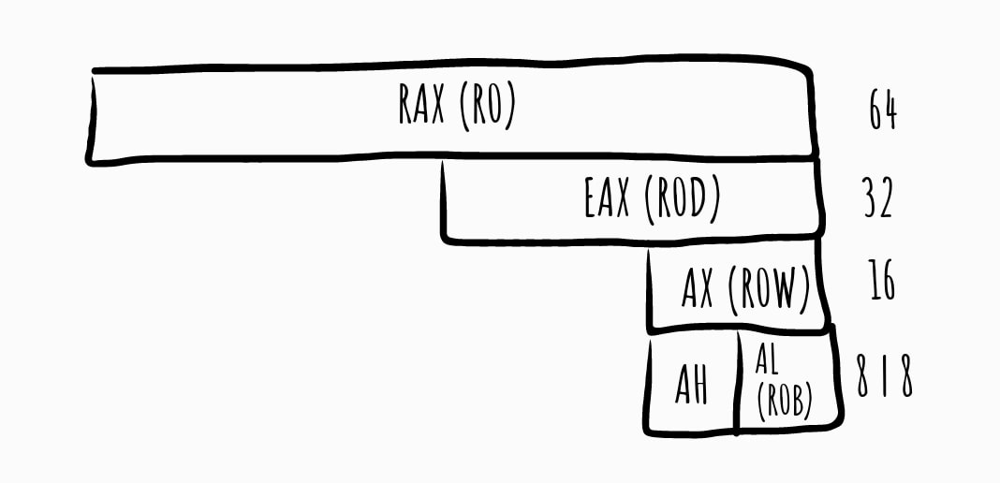
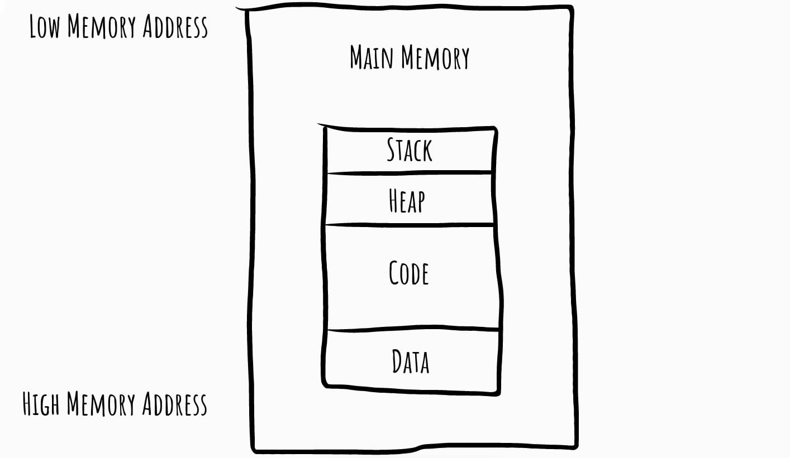
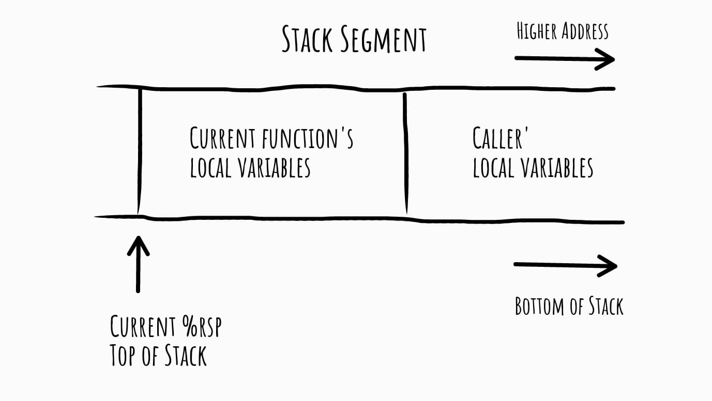

Introduction to x86-64 architecture, low-level programming, drivers development and many others interesting things.

#### Abstraction Layers

Computer system can be represented
as several levels of abstraction that create a way of hiding the implementation
details. For example, you can run the FreeBSD on many different types
of hardware, because the underlying hardware is abstracted from the OS.

##### Interpreted Languages

Most programmers operate at the level of interpreted languages.
The code at this level is not compiled into machine code; instead,
it is translated into bytecode. Bytecode is an intermediate representation
that is specific to the programming language. Bytecode executes within
an interpreter, which is a program that translates bytecode into executable
machine code on the fly at runtime.

An interpreter provides an automatic
level of abstraction when compared to traditional compiled code,
because it can handle errors and memory management on its own, independent
of the OS.

##### High-level Languages

High-level languages provide strong abstraction
from the machine level and make it easy to use programming logic and
flow-control mechanisms. High-level languages include C, Rust, Haskell and others.
These languages are typically turned into machine code by a compiler.

##### Low-level Languages

A low-level language is a human-readable version
of a computer architecture’s [instruction set](https://en.wikipedia.org/wiki/Instruction_set_architecture). The most common low-level
language is assembly language. Machine code is too difficult for a human to
comprehend. We use a disassembler to generate low-level language text,
which consists of simple mnemonics such as mov and jmp. Many different
dialects of assembly language exist, dependent of architecture.

##### Machine Code

The machine code level consists of [opcodes](https://en.wikipedia.org/wiki/Opcode), hexadecimal
digits that tell the processor what you want it to do. Machine code is typically
implemented with several microcode instructions so that the underlying
hardware can execute the code. Machine code is created when a
computer program written in a high-level language is compiled.

##### Microcode

The microcode level is also known as firmware. Microcode
operates only on the exact circuitry for which it was designed. It contains
microinstructions that translate from the higher machine-code level to
provide a way to interface with the hardware. It is often
specific to the computer hardware for which it was written.

##### Hardware

The hardware level, the only physical level, consists of electrical
circuits that implement complex combinations of logical operators
such as XOR, AND, OR, and NOT gates, known as digital logic. Because
of its physical nature, hardware cannot be easily manipulated by software.

#### x86-64 Components

The internals of most modern computer architectures follow
the Von Neumann architecture (however the architecture has a few significant limitations, thus is frequently replaced by, for example, [Modified Harvard Architecture](https://en.wikipedia.org/wiki/Modified_Harvard_architecture))

The control unit gets instructions to execute from RAM using a register (the
instruction pointer), which stores the address of the instruction to execute.
Registers are the CPU’s basic data storage units and are often used to save
time so that the CPU doesn’t need to access RAM.

The arithmetic logic unit
(ALU) executes an instruction fetched from RAM and places the results in
registers or memory. The process of fetching and executing instruction after
instruction is repeated as a program runs.

##### Registers

Each register is 64 bits wide; the lower 32-, 16- and 8-bit portions are selectable by a pseudo-register name. Some registers are designated for a certain purpose, such as %rsp being used as the stack pointer or %rax for the return value from a function. Other registers are all-purpose, but have a conventional use depending on whether caller-owned or callee-owned.

###### Caller-owned & Callee-owned Registers

The calling convention gives callers and callees certain guarantees and responsibilities about the values of registers across function calls. Function implementations may expect these guarantees to hold, and must work to fulfill their responsibilities.

The most important responsibility is that certain registers’ values must be preserved across function calls. A callee may use these registers, but if it changes them, it must restore them to their original values before returning. These registers are called callee-saved registers. All other registers are caller-saved.

Callers can simply use callee-saved registers across function calls; in this sense they behave like C++ local variables. Caller-saved registers behave differently: if a caller wants to preserve the value of a caller-saved register across a function call, the caller must explicitly save it before the callq and restore it when the function resumes.

On x86-64 Linux, %rbp, %rbx, %r12, %r13, %r14, and %r15 are callee-saved, as (sort of) are %rsp and %rip. The other registers are caller-saved.

##### Random-access Memory

The main memory (RAM) for a single program can be divided into the following
four major sections.

###### Stack

Stack is a segment of memory used to store objects with automatic lifetime. Typical stack addresses on x86-64 look like 0x7ffd'9f10'4f58—that is, close to 2^47.

The stack is named after a data structure, which was sort of named after pancakes. Stack data structures support at least three operations: push adds a new element to the “top” of the stack; pop removes the top element, showing whatever was underneath; and top accesses the top element. Note what’s missing: the data structure does not allow access to elements other than the top. (Which is sort of how stacks of pancakes work.) This restriction can speed up stack implementations.

Like a stack data structure, the stack memory segment is only accessed from the top. The currently running function accesses its local variables; the function’s caller, grand-caller, great-grand-caller, and so forth are dormant until the currently running function returns.

###### Heap

The heap is used for dynamic memory during program execution,
to create (allocate) new values and eliminate (free) values that the program
no longer needs. The heap is referred to as dynamic memory because
its contents can change frequently while the program is running.

###### Code

Code includes the instructions fetched by the CPU to execute
the program’s tasks. The code controls what the program does and
how the program’s tasks will be orchestrated.

###### Data

This term can be used to refer to a specific section of memory
called the data section, which contains values that are put in place when a
program is initially loaded. These values are sometimes called static values
because they may not change while the program is running, or they
may be called global values because they are available to any part of the
program.

##### Arithmetic Logic Unit

The Arithmetic Logic Unit (ALU) is the heart of any CPU. An ALU performs three kinds of operations, i.e.

- Arithmetic operations such as Addition/Subtraction,
- Logical operations such as AND, OR, etc. and
- Data movement operations such as Load and Store

A simple ALU design is constructed with Combinational circuits. ALUs that perform multiplication and division are designed around the circuits developed for these operations while implementing the desired algorithm.

More complex ALUs are designed for executing floating point, decimal operations and other complex numerical operations. These are called [coprocessors](https://en.wikipedia.org/wiki/Coprocessor) and work in tandem with the main processor.

The design specifications of ALU are derived from the [Instruction Set Architecture](https://en.wikipedia.org/wiki/Instruction_set_architecture). The ALU must have the capability to execute the instructions of ISA. An instruction execution in a CPU is achieved by the movement of data/datum associated with the instruction. This movement of data is facilitated by the Datapath. For example, a LOAD instruction brings data from memory location and writes onto a GPR.

The navigation of data over datapath enables the execution of LOAD instruction. We discuss Datapath more in details in the next chapter on Control Unit Design. The trade-off in ALU design is necessitated by the factors like Speed of execution, hardware cost, the width of the ALU.
